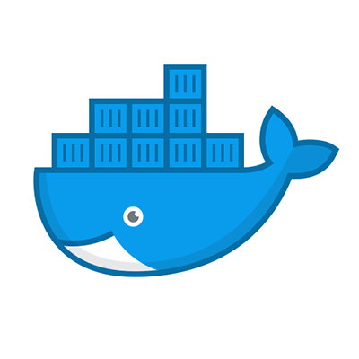

[cols="1a,1a,1a,1a,1a,1a,1a,1a,1a,1a"]
|===

| image::images/duke.png[role=blur]
|
image::images/gradle.png[role=blur]
image::images/nebula.png[role=blur]
.2+|
image::images/bitbucket.png[role=blur]
.2+| image::images/jenkins.png[role=blur]
image::images/rocket.svg[role=blur]
.2+| image::images/package.png[role=blur]

.2+|
image::images/artifactory.png[role=blur]

.2+| image::images/spinnaker.png[role=blur]

.2+|
image::images/aws-ec2.svg[role=blur]

.2+|
image::images/atlas.png[role=blur]
image::images/alerts.png[role=blur]
.2+| image::images/astrid.png[]

| image::images/node.png[role=blur]
| image::images/npm.png[role=blur]

|===
