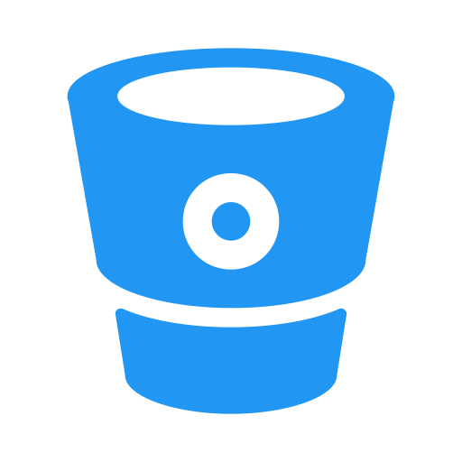

[cols="1a,1a,1a,1a,1a,1a,1a,1a,1a,1a"]
|===

| image::images/duke.png[]
|
image::images/gradle.png[role=blur]
image::images/nebula.png[]
.2+|

.2+| image::images/jenkins.png[role=blur]

.2+| image::images/package.png[role=blur]
image::images/debian.png[]
image::images/docker.png[role=blur]
.2+|
image::images/artifactory.png[]
image::images/titus.png[role=blur]

.2+| image::images/spinnaker.png[role=blur]
image::images/managed-delivery.png[]

.2+|
image::images/aws-ec2.svg[]
image::images/titus.png[role=blur]
.2+|
image::images/atlas.png[]
image::images/alerts.png[]
.2+| image::images/astrid.png[]

| image::images/node.png[role=blur]
| image::images/npm.png[role=blur]

|===
