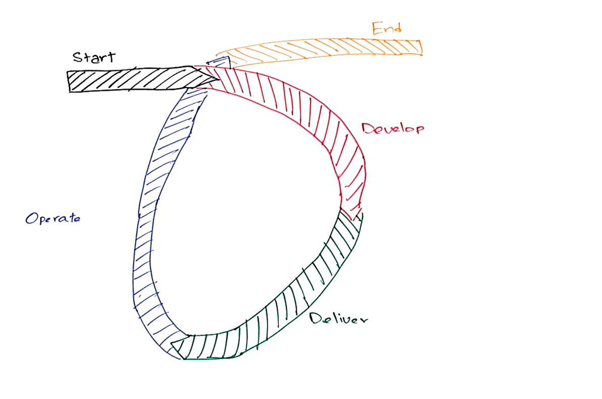
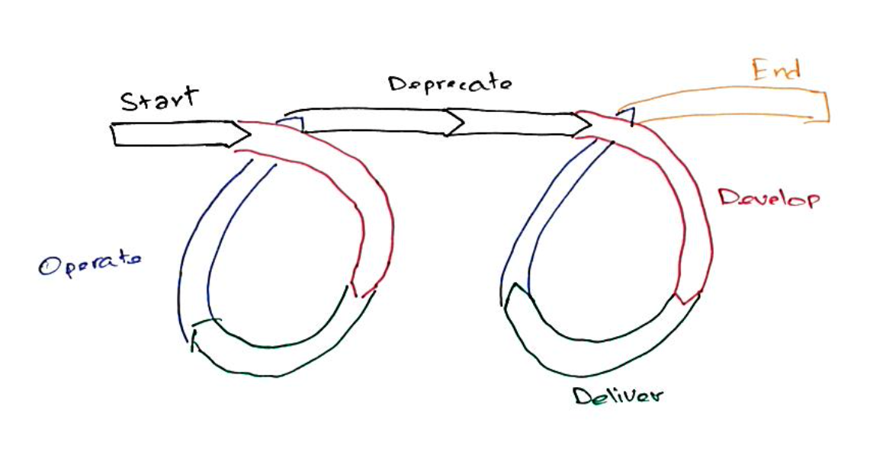
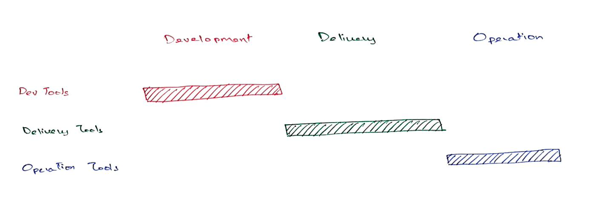
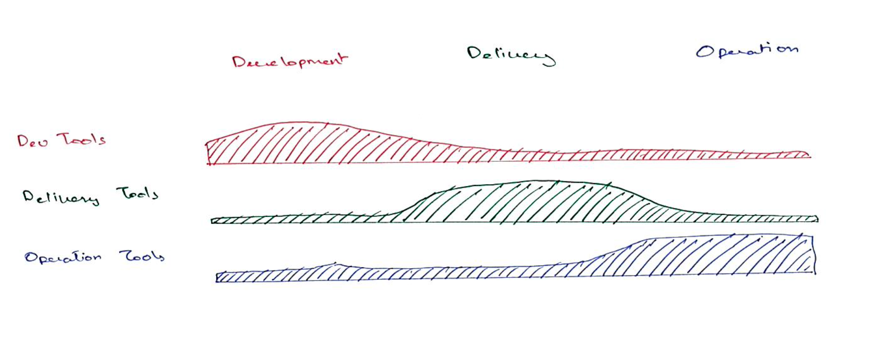
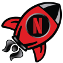

= How Netflix Builds Code
:author: Rahul Somasunderam
:includedir: .

++++
<!-- TODO: Use docinfo for this -->
<script src="https://code.jquery.com/jquery-2.2.4.min.js"></script>
<script>
	var header = $('<div class="footer">How Netflix Builds Code <br/><small>Rahul Somasunderam, Build Meetup 2021</small></div>');
	$('div.reveal').append(header);
</script>
++++

[NOTE.speaker]
--
Hello!
My name is Rahul.
I work on CI at Netflix.
I'm going to talk to you about how we build code.
--

[transition=none-out]
== What does a team look like?

include::{includedir}/_pie-chart.adoc[]

[NOTE.speaker]
--
Most teams have at least a few different roles.

Typically, you aim for hiring people with a T-shaped experience.
They have depth of expertise in their primary job, and enough experience to get by in other areas. 
Their team mates will have expertise in those other areas.

To go from one team to many such teams, you need to replicate these teams. That is often hard.
--

[transition=none-in]
=== How does a Netflix team look like?

include::{includedir}/_donut-chart.adoc[]

[NOTE.speaker]
--
We try to solve this problem by using what we call "Full Cycle Development".

You don't need depth of experience in areas that are shared across teams, like, infrastructure, CI, CD, build systems, networking, metrics.

This is not a problem because we have **central teams** develop tools that help these teams solve most problems independently.

This makes it easier for us to scale orgs - it's easier to build teams of people who have lots of development skills and just enough understanding of these tools that we share.
--

=== What is the full cycle?



[NOTE.speaker]
--
This is what one typically does.
Each project has a beginning and eventually, an end.
In between this, we repeatedly develop new features, deploy them, observe and support them.
--

=== What is supported?



[NOTE.speaker]
--
Every so often, we tend to look at all the versions of an API or library or a tool that our users depend on, and decide to deprecate older ones.

That helps us reduce the support burden.

Deprecations **ARE** an essential part of the lifecycle of software.
--

=== What kind of teams support these tools?



[NOTE.speaker]
--
It's tempting to think that we have teams that work in these individual areas. 
There are clear boundaries of what each of these central teams does.
--

=== What it really looks like



[NOTE.speaker]
--
In reality, all central teams have some role to play throughout the lifecycle of software.
--

[transition=none]
=== Guardrails, not gates


[.attribution]
"TX 375 Road - Mountains 2" by formulanone is licensed with CC BY-SA 2.0.

[NOTE.speaker]
--
One of the guiding principles for central teams at Netflix is, _Guardrails, not gates_.
That means central teams will provide guidance and build tools that make risky tasks safer for other teams.
We prefer to not stop teams from doing something that falls outside our recommendations.

As a result, we do not have approved tools and languages. 
Instead, we have _the paved road_.
--

[transition=none]
=== The unpaved road


[.attribution]
"Olympic Mountain Bike Cross Country Cycling Race - London 2012 MTB" by Sum_of_Marc is licensed with CC BY-NC-ND 2.0.

[NOTE.speaker]
--
But, to appreciate the paved road, you need to first understand the unpaved road.

This picture is from the 2012 London Olympics for Cross Country Mountain biking.
You don't see mechanics and medics supporting the riders.

If you're doing this as a hobby, you sure need to carry a lot of tools and spares with you.
--

[transition=none]
=== The paved road


[.attribution]
"UCI Worlds in Valkenburg, September 2012 THE TEAM TIME TRIAL" by sjrowe53 is licensed with CC BY-NC-ND 2.0.

[NOTE.speaker]
--
And **this** is at the UCI Worlds from the same year.

There's a team car right next to the riders.
If something goes wrong - either mechanically or as a minor injury to the rider, they can fix things right then and there.
Sometimes, even as the rider is riding.

If you're doing this as a hobby, you can phone a friend to come pick you up if something goes wrong.

That's exactly what the paved road looks like in Software Development.

At Netflix, we have something in our culture deck called _Freedom And Responsibility_.
Each team is free to decide how to accomplish their goals.
They have the responsibility to act in the company's best interest.

That means, you don't _have_ to go on the paved road, but if you are on the paved road, you get amazing support from central teams.
--

=== What we support

* 🤷 A few thousand users
* 🤷 A few hundred teams
* ~45k repositories
* ~45k job definitions
* ~600k builds per week

[NOTE.speaker]
--
My team works on Continuous Integration and is one of those central teams.
Many central teams support some subset of everyone whose role is Engineer or close enough.
My team supports every one of them.
--

[transition=fade-out]
== What are the tools like

include::{includedir}/_tools.adoc[]

[NOTE.speaker]
--
There is a lot going on here.

Many of these tools would be familiar to you.

Because we allow people to be on the unpaved road, any list we make can never be exhaustive.
The paved road is not a sign of the importance of things.
It mostly corresponds to the impact we can achieve as central teams.
--

[transition=fade]
=== What are the tools like

include::{includedir}/_tools_oss.adoc[]

[NOTE.speaker]
--
Many are open source.
--

[transition=fade]
=== What are the tools like

include::{includedir}/_tools_commodity.adoc[]

[NOTE.speaker]
--
Some are commodity products that anyone can access.
--

[transition=fade]
=== What are the tools like

include::{includedir}/_tools_internal.adoc[]

[NOTE.speaker]
--
A few are internal tools, but there isn't too much that should be inaaccessble to people outside of Netflix.
There are similar open-source and commercial solutions available if you choose to take inspiration from this.
--

[transition=fade]
=== What are the tools like

include::{includedir}/_tools_path.adoc[]

[NOTE.speaker]
--
For the purpose of this talk, let's take this path.
We'll see briefly what all the tools look like but spend more time on this one path.
--

[transition=fade]
=== The Java Path

include::{includedir}/_tools_gradle.adoc[]

[NOTE.speaker]
--
Gradle has been around since 2007. 
It's a solid build tool that uses a slightly different way of doing things.

It's predecessors were Ant and Maven.
Ant was a very open scripting solution that used XML to describe the build.
Maven brough some structure using its repository structure and lifecycle phases.

Gradle brings in structure using its Directed Acyclical Graph and a very simple plugin model.
--

[transition=fade]
=== The Java Path

include::{includedir}/_tools_nebula.adoc[]

[%step]
--
```groovy
allprojects {
  apply plugin: 'netflix.nebula'
}
```
--

[NOTE.speaker]
--
Nebula is Netflix's take on what gradle builds should be like.
It is a custom distribution of Gradle that we've developed.
Large parts of it are open source, but there are some bits and pieces that are internal to Netflix.
The non-OSS bits mostly deal with getting to Netflix's repositories for downloading and publishing artifacts.

It's as simple as adding one line to your `build.gradle`.
The Nebula plugin applies lots of open source Nebula plugins to your project to configure it correctly.
But it also checks what other plugins are applied and configures them in a way that's appropriate for building at Netflix.
It also configures publishing correctly.
Most teams apply `netflix.nebula` to their `allProjects` block and then add just a simpler plugin on each sub project - e.g. a Springboot plugin or a java library plugin.
--

[transition=fade]
=== The Node Path

include::{includedir}/_tools_node.adoc[]

[NOTE.speaker]
--
If you're developing a Node app, it's very likely you're building with npm.
And we have a `devDependency` for something similar to `netflix.nebula` that does some of the same things for Node/NPM.
--

[transition=fade]
=== Version Control

include::{includedir}/_tools_stash.adoc[]

[NOTE.speaker]
--
As you develop code, you push it to your project's git repository.
Some teams rely on Pull Requests, some don't.
Some will use forks, others won't.
Some of you might prefer to use monorepos.
We prefer to have a repository per releaseable-group.

What does a releasable group mean?

If you're building microservices, you might have a `user-service` and a `movie-service`.
These two have different cadences, so you're going to release them separately, and so they belong in different repositories.
However, when you release your `user-service`, you might be releasing the `user-java-client` and `user-node-client` at the same time.
So those two would belong in the same repository as the `user-service`.
--

[transition=fade]
=== The CI Phase

include::{includedir}/_tools_jenkins.adoc[]

[NOTE.speaker]
--
Once your commit occurs, it's time for Jenkins to pick up your code and build it.
Configuring everything correctly with Jenkins is hard for many engineers.
--

[transition=fade]
=== The CI Phase

include::{includedir}/_tools_rocket.adoc[]

[NOTE.speaker]
--
So we built something called Rocket CI which is a layer on top of Jenkins that makes it easy to do that at Netflix.
It's opinionated, but it's easier to maintain.

You can curl an endpoint to setup a Jenkins job that does everything correctly and specify what kinds of builds you want - only the main branch, or pull requests, or tags, or a combination of these.

Most build configurations are simple enough that we expose a handful of properties through a yaml file that's in the project's repository.
The build itself is a shell script that can be checked in.

If you have as many repositories as we do, and you push code as often as we do, webhooks become unreliable as a way to trigger builds.
Even falling back to polling can result in service degradation.

So we built plugins for our Bitbucket, Jenkins, Artifactory and Spinnaker to rely on SNS and SQS.

Whenever a code event occurs, the plugin for Bitbucket emits an event that can be consumed by any service.
Rocket consumes that event and triggers a build.

Whenever a build event occurs, Rocket emits that event on the SNS topic.
--

[transition=fade]
=== The CI Phase

include::{includedir}/_tools_artifact.adoc[]

[NOTE.speaker]
--
Once your build succeeds, it produces an artifact.
It could be a debian or a docker image, or something toolchain specific - like an npm package or a jar.
Sometimes, it is even just be a tar file.

--

[transition=fade]
=== The CI Phase

include::{includedir}/_tools_artifactory.adoc[]

[NOTE.speaker]
--
If it's a docker image, it goes to the Titus Container Registry.
If not, it typically goes to Artifactory.

If you're building a library or CLI, your journey mostly ends here.
However, it's more likely that you're building a service and need to deploy it somewhere.

When an artifact is published to artifactory, our plugin there emits an event.
--

[transition=fade]
=== The CI Phase

include::{includedir}/_tools_ci_spin.adoc[]

[NOTE.speaker]
--
Spinnaker could consume either the build event or the artifact event, and begin deploying your code. 
We are going to choose the artifact event for this talk.
--

[transition=fade]
=== More CI tasks

&nbsp;



[NOTE.speaker]
--
Keeping projects healthy is something we can easily do during the CI phase.

We have system that's based on enrollments and docker images that works a lot like dependabot, but does more than dependency updates.

If a central team can define a migration in a docker image, they can use this to effect change in all repositories at Netflix and send Pull Requests to teams to have them review and merge these.

Some kinds of changes are routine enough that we have enough confidence to merge these on successful PR builds.
Examples of these are tool version upgrades, dependency updates, and lint fixes.
--

[transition=fade]
=== The CD Phase

include::{includedir}/_tools_spin.adoc[]

[NOTE.speaker]
--
For a long time, the way to do CD in Spinnaker was to define a pipeline.
--

[transition=fade]
=== The CD Phase

include::{includedir}/_tools_md.adoc[]

[NOTE.speaker]
--
More recently, Spinnaker introduced something called Managed Delivery.
For many applications, this is an adequate solution.
And if it is adequate, you do not need to create and maintain pipelines for it.
You would be familiar with how docker images are immutable.
We try to do something similar for EC2 deployments.
The debians that we built earlier are baked into Amazon Machine Images (AMIs for short).

The next step is the deployment itself.
Depending on what you're building, you might either deploy to Titus - if it's a docker image.
If it's not, it's very likely, you're deploying to EC2.
--

[transition=fade]
=== Operating

include::{includedir}/_tools_operating.adoc[]

[NOTE.speaker]
--
Now that your code is running, you need to monitor it.
We have Atlas reporters for most of our runtimes.
These send metrics to the Atlas service.
From there, it can be used to trigger alerts, or create dashboards.
--

[transition=fade]
=== Operating

include::{includedir}/_tools_astrid.adoc[]

[NOTE.speaker]
--
* Astrid helps keep track of what's running. 
  ** During a bake, it will gather information on what debians go into each AMI.
  ** It can find out from metadata that we publish what goes into each debian.
  ** It know about each jar & npm package we're running in addition to the debians.
  ** It can do the same thing for docker layers too.

* Once a quarter, teams that publish libraries will get together and say what the minimum version of their library should be.
Astrid will take this input and start sending nudges to anyone who consumes the library pointing to where they are using an older version.
This allows teams to update their dependencies.
If the version is too old, we can prevent new deploys from happening.

* But it doesn't always have to happen once a quarter.
For example, if you depend on an OSS library for which a CVE (Common Vulnerabilities and Exposures) has been published for a specific version, we can block your deploys until you update to a safe version.
This can happen at any time.
Our build tooling also has a way to check for this, and can prevent your builds from happening.
--

[transition=fade]
=== Too many tools?

include::{includedir}/_tools.adoc[]

[NOTE.speaker]
--
As you can imagine setting up all of this for every project could be a huge task.
--

[transition=fade-in]
=== Newt

include::{includedir}/_tools_newt.adoc[]
|===
a| image::images/newt.png[]
|===

[NOTE.speaker]
--
We have a tool for this called Newt.

You can think of Newt as Yeoman+Sdkman+NVM+RVM plus a lot more.

It has a templating system like Yeoman does.
That helps you bootstrap your repository.

But it also knows how to talk to all these other services and configure them correctly.

Furthermore, it also wraps build tools. 
So you can configure your repository with information on what build tool needs to be selected. E.g. Node 12.16.2 and NPM 6.14.4.
Then you can call `newt build`, and it will download the right tools and call the appropriate command for your build tool.
This means that when you check out a new repository, you don't need to try to figure out how to build it.

For most app-types, you can go from wanting to start a new app to having a hello-world up and running in production in about 15 minutes.
--

== Thank you

&nbsp;

&nbsp;

https://jobs.netflix.com[jobs.netflix.com]
