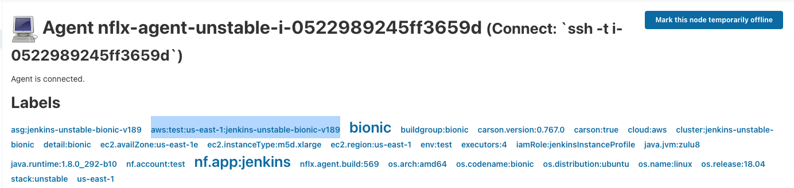
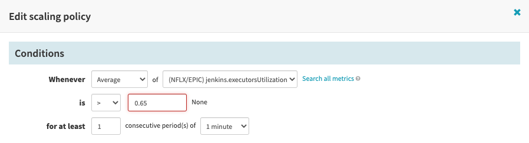
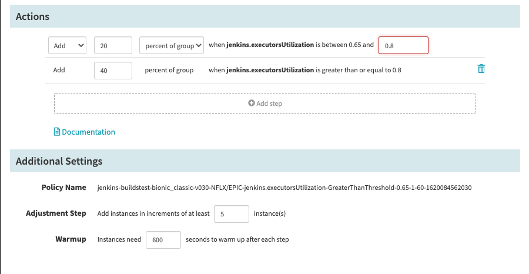
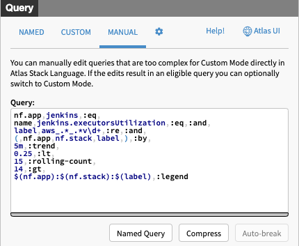
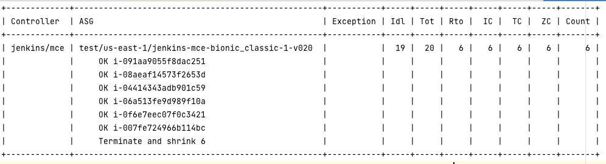
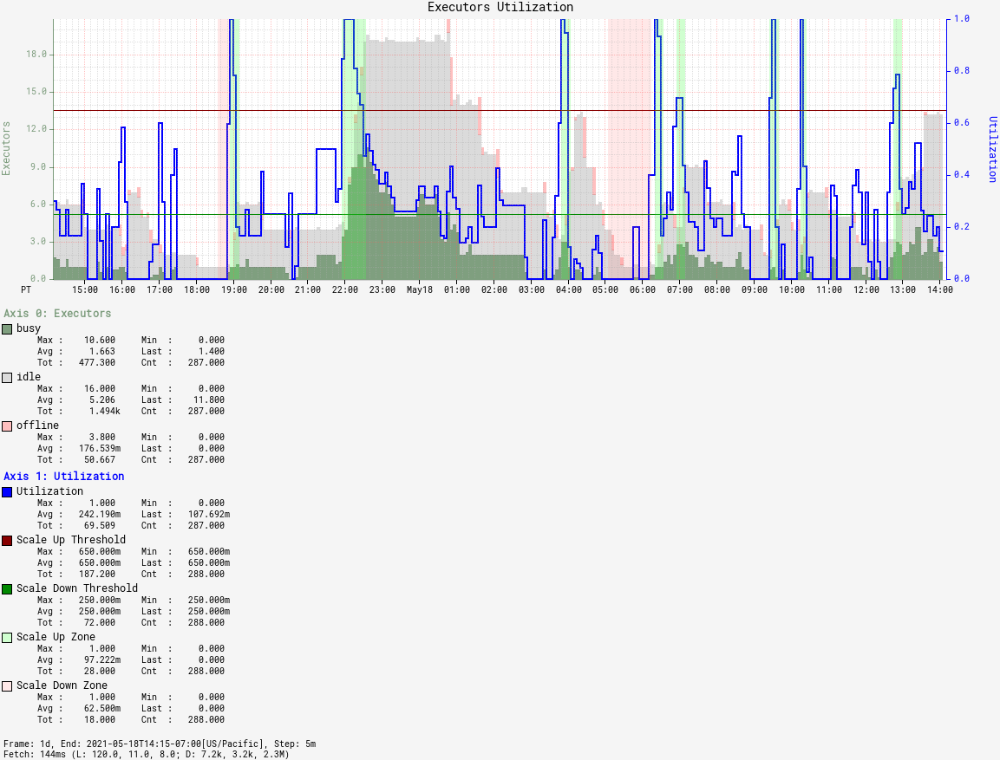

= How Netflix Autoscales CI
:author: Rahul Somasunderam
:stem:

++++
<!-- TODO: Use docinfo for this -->

++++

[NOTE.speaker]
--
Hi!
My name is Rahul.
I work on CI at Netflix.
I'm going to talk to you about what we did to get CI to Autoscale.
--

== What does CI look like at Netflix

[NOTE.speaker]
--
Let's first look at Netflix's CI setup.
--

=== Jenkins @ Netflix

* 35 Jenkins controllers
* ~45k job definitions
* ~600k builds per week
* 650-1500 agents
* 1-100 executors per agent

[NOTE.speaker]
--
We use Jenkins.

These are some numbers to help you see what we're working with.

The reason the number of agents is a range is: We autoscale. So depending on when you look at this, you would get a different number.

The reason the executors/agent is a range is: We run multiple kinds of agents. These would have different labels to target specific kinds of builds.
--

=== The Spinnaker view

* 1 Application
* 35 stacks (Controller Clusters)
* 180 Agent Clusters
* 1+ ASG per cluster
* All workloads on AWS

[NOTE.speaker]
--
We use Spinnaker for delivery.

Each of our Jenkins controllers runs in its own cluster. We make sure there is only one instance running at a time. If you're running Jenkins controllers, this should be no different from what you're used to.

There are 180 different agent clusters - each has a fixed configuration - instance type, labels, region, etc.

The reason we have more than one ASG is: When we roll out updates, we wait for the new ASG to come online and then we mark the old one offline in Jenkins, and wait for the builds to drain.
As builds drain, we terminate instances.
If we see problems, we can rollback to the old ASG.
After a few days of the new ASG being online, and the old one being down to 0 agents, we destroy the ASG.
In very rare occasions there are more than 2 ASGs in the cluster.
--

=== Clusters and ASGs

[%step]
* AWS has Auto Scaling Groups
* Spinnaker calls them Server Groups
* `<Application>-<Stack>-<Detail>-v<Version>`
* `jenkins-unstable-agent-highlander-v123`

[NOTE.speaker]
--

<step>

AWS has Auto Scaling Groups - ASGs for short.
On each ASG, you can set a min and a max.
Then AWS will figure out what the desired size is, and adjust the current size by either spinning up a new instance or killing some running instance.

<step>

Spinnaker calls those things Server Groups.

<step>

Spinnaker has a naming convention that maps the Server Group to a more structured coordinate.
At the top level, there's an application.
Within each application, you can have multiple stacks.
We map these to Jenkins controllers.

Within each stack, you have multiple clusters.
The naming relies on a field called `detail` for that.
We put one kind of agent into each cluster.

For example,
So one would have `m5.2xlarge` instances and run 4 executors.
Another would have `m5.4xlarge` instances and run 1 executor.

We perform immutable deployments.
If we want to update a package, we bake a new Amazon Machine Image and start rolling it out.
So each cluster will have multiple Server Groups representing the version.

<step>

In this example:

* `jenkins` is the application
* `unstable` is the stack
* `agent-highlander` is the detail
* `123` is the version

That whole thing is the name of the server group.
The cluster is `jenkins-unstable-agent-highlander`.
The version is not part of it.
--

== How to plan for CI infrastructure

[NOTE.speaker]
--
Planning for CI infrastructure is in some ways similar to planning for other applications.
You need to plan ahead of time to make sure you've got enough capacity.
There are some differences in CI workloads, though.
--

=== Infinite resources

* Provision capacity based on known maximum load
* Multiply by a safety factor for good measure
* Monitor and change the capacity as load increases

[NOTE.speaker]
--
The first way is to assume infinite resources.

This is the easiest way to do things. You guess what the maximum workload is, and you pad that estimate and provision capacity.

Then you keep revising your estimate as you go along.

The downside of this is: you will have lots of idle capacity.
And depending on the size of your company, you could be wasting a lot of resources.

However, for a small-ish company, this is a great solution.
The resource overhead may not be significant.

The users of your CI solution are going to be happy - they get instant build starts.
Your capacity planning and budgeting teams might not like the cost of this solution at some point.
--

=== Infinite Patience

* Plan capacity based on median load
* Builds will sit in queue for long times

[NOTE.speaker]
--
Or you could assume infinite patience.

Let's say you know how many instances you need in a median hour.
You could plan for that.

Most of the time, you will have instant build starts.
However, there will be several moments when developers are waiting for other builds to finish so theirs can start.

Eventually, developers will become very unhappy.
--

=== Instant resources

* You will get resources as soon as you request for them
* Works well with Containerizable builds
* Not all builds can be containerized
* Does not scale well with large numbers of short-lived builds

[NOTE.speaker]
--
In some cases you can plan for instant resources.

This assumes that there is a shared pool that you can get resources from.
It works really well with Containers. E.g. Kubernetes.

Not all builds can be containerized. You could be running docker commands inside of your build. Or you could be using testcontainers in your build. There isn't really a prudent way to run docker-in-docker.

Also, Jenkins doesn't handle too many agents particularly well.
It's easier to run a hundred agents with 10 executors each than it is to run a thousand agents with 1 executor each.
--

=== Autoscaling

* Set up minimum and maximum capacity
* Scale based on some metric

[NOTE.speaker]
--
Finally, there's autoscaling.

This approach tries to contain costs while still _trying_ to provide instant build starts.
We have been fairly successful with this.
--

== What Metric to use

[NOTE.speaker]
--
Almost all autoscaling tries to match some metric indicating demand with an appropriate supply.

Let's look at what metrics we can use.
--

=== System Metrics

[%step]
[none]
* CPU/Memory/Disk IO/Network throughput
  ** Natively supported by cloud providers and most metrics solutions
* Scaling Policies are supported by cloud providers

[NOTE.speaker]
--
There are some system metrics that we often associate with autoscaling.

<step>

The nice thing about these is: they are natively supported by cloud providers and most metrics collection solutions. You need to do very little work to get the metrics somewhere.

<step>

Scaling with these metrics is also, really well documented.
--

=== System Metrics

Not very useful for CI

[NOTE.speaker]
--
However, this doesn't really work well for CI.

There are times when one or all of those are all really low, but your build is still running. And it's holding on to an executor on Jenkins.

And if you have many such builds, you will need to scale up to start new builds.
More importantly, you cannot scale down because one or all of those metrics are low.
--

=== Queue Depth

[%step]
[none]
* Queue Depth seems adequately proportional.
* However, it is a trailing metric.

[NOTE.speaker]
--
Queue Depth is an attractive metric.

<step>

It tells exactly how many builds need an agent.
So you might be able to measure queue depth and add the correct number of instances to the ASG based on it.

<step>

However, queue depth indicates that builds have already begun queueing up.
So you are already late trying to fix this.

In the case of Containerized agents, where the time to start an agent is negligible, this is not so bad, but between the metrics reporting this and EC2 launching an instance and the instance booting up and launching the jenkins agent, there's a lot of time being spent.
--

=== Agent Utilization

[%step]
[none]
* For each agent, find [idle, busy, offline] executors.
* Sum these up by ASG.
* Compute utilization as stem:[(busy + offli\n\e) / (busy + offli\n\e + id\l\e)]

[NOTE.speaker]
--
Agent Utilization is possibly the most relevant metric for Jenkins.

<step>

You have some number of executors.
Of them some subsets are busy, idle and offline.

<step>

You will need to group these by ASG.

<step>

Once you have that, you can compute utilization easily.
We use this formula.
--

== Measuring Agent Utilization

[NOTE.speaker]
--
Let's see what it takes to measure agent utilization correctly...
--

=== An agent's ASG

When launching agents, use labels to specify the placement of the agent.

[NOTE.speaker]
--
When we launch a new agent, we have it launch with many labels.

We don't expect users to target some of these labels. They can, but they don't. These labels are useful for us to collect metrics.

We report the placement of the ASG.
In this case, we're reporting that the ASG is on `AWS`, it's in our `test` account, it's in `us-east-1` and it's name is whatever the rest of the highlighted text is.
--

=== Capturing Metrics

We wrote a custom plugin that plays well with Atlas.
You could write one for whatever your metrics capturing service is.

[NOTE.speaker]
--
Next up, we wrote a custom plugin.

The most important thing it does for autoscaling is: it reports the idle, busy, offline, total executors and executor utilization per ASG.

Atlas is our metrics collection system.
It ties into AWS and can forward a custom metric to cloudwatch, which we do.
It ties into its alerting system and can send emails, and slack notifications. But it can also, launch a Jenkins build or launch a spinnaker pipeline when an alerting condition is satisfied.
--

== Autoscaling

[NOTE.speaker]
--
Now that we've got our metrics where we want them, let's look at how we can autoscale based on it.
--
=== How to Autoscale

AWS offers 2 ways to scale

* Target Tracking
* Step Scaling

[NOTE.speaker]
--
There are 2 ways that you can scale on AWS.

The first is target tracking.
It's really cool.
You tell it what you want a metric to be.
**It** figures out whether to scale, when to scale, and how fast to scale.

However, this is not ideal for Jenkins.
We cannot let it arbitrarily kill instances that are running builds.
So we will have to stick to step scaling.

We specify a set of thresholds and how the system should react to the utilization reaching that threshold.
--

=== When to scale up

[NOTE.speaker]
--
In this picture you see Spinnaker being used to configure AWS autoscaling.
We're setting it up to scale up when utilization is ove 65% for at least 1 minute.
--

=== How to scale up

[NOTE.speaker]
--
Now that we know we need to scale up, let's see how we can scale up.

We're going to increase capacity by 20% if the utilization is between 65% and 80%.
If it's over 80%, we're going to speed things up and add 40% capacity.

Also, we'll try to add at least 5 instances when we scale up.
This allows us to scale more rapidly at lower capacities.

Next up, we need to wait adequately long before sending more instances into the ASG. You don't want to keep scaling up while your instances are still booting up.
--

=== When to scale down

[NOTE.speaker]
--
Scaling up was easy. Scaling down is much harder.

The way we do it is: we setup an alert that gets fired when utilization for an ASG is under 25% and stays that way for 15 minutes or longer.
--

=== How to scale down

[NOTE.speaker]
--
When that happens we run a custom program that talks to the Jenkins controller and finds out which agents are idle.
Then it carefully marks them offline.
We have a configurable ratio per ASG. So you mark at most the ratio times the total instances offline.
You also run some checks to make sure you're not zeroing out or terminating more instances than are idle.

Once you have a number, you call AWS to "Terminate specific instances and shrink the ASG's desired size"

We initially had the alert call out to Jenkins.
Later on we switched to calling a Spinnaker pipeline instead.
We liked not to have Jenkins be in the way of scaling down Jenkins.
--

=== Recap

[NOTE.speaker]
--
Once we put all of this together, you get a system like this.

Where you see the blue line go over 0.65, there's the green background indicating a scale up.

Where you see the blue line go below 0.25, there's a red background after 15 minutes indicating a scale down.
--

== What we learnt

[%step]
* This improved support experience
* This improved the experience for spiky workloads

[NOTE.speaker]
--
<step>

* We set min to 1, set max to 3x original fixed size when we started autoscaling.
  That significantly reduced support requests from users asking to resize clusters.

<step>

* Some agent clusters existed solely to serve spiky workloads.
  They would get a burst of 10s-100s of builds within an hour, and then never run again for days.
  Supporting them economically became possible.
--

== Thank you!

&nbsp;

&nbsp;

https://jobs.netflix.com[jobs.netflix.com]

[NOTE.speaker]
--

--
